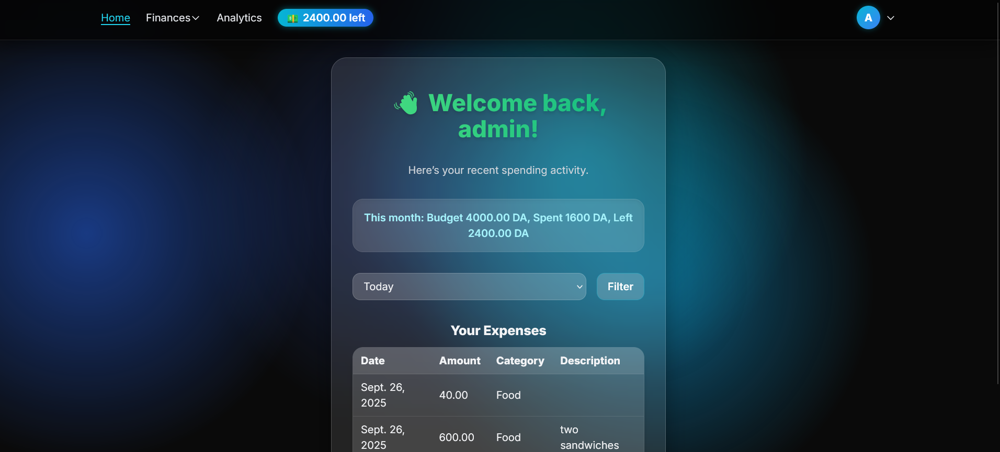

# Expense Tracker – Django Project

<p align="center">
  
  <br>
  <strong>Main Dashboard – Track your expenses and budget in one place</strong>
</p>

---

## Table of Contents

- [Project Overview](#project-overview)
- [Features](#features)
- [Tech Stack](#tech-stack)
- [Installation](#installation)
- [Usage](#usage)
- [API Endpoints](#api-endpoints)
- [User Authentication](#user-authentication)
- [Budget and Analytics](#budget-and-analytics)
- [Contributing](#contributing)
- [License](#license)
- [Contact](#contact)

---

## Project Overview

Expense Tracker is a Django-based web application designed to help users:

- Monitor and manage their expenses  
- Set monthly budgets  
- Organize expenditures by categories  
- Analyze spending trends with interactive charts  

The project emphasizes user authentication, an intuitive interface, and useful financial insights through analytics – all wrapped in a dark, modern UI built with Tailwind CSS.

---

## Features

- User Authentication – Registration, login, and logout using Django's built-in system  
- Expense Management – Add, view, edit, and delete expenses with categories  
- Budget Tracking – Define monthly budgets and track remaining funds in real time  
- Date Filtering – View expenses by day, week, or month  
- Analytics Dashboard – Visualize monthly and category-based spending trends  
- Responsive Design – Built with Tailwind CSS for a clean and modern look  
- Secure Views – Login required for expense, budget, and category pages  

---

## Tech Stack

- **Backend:** Django 5.2.5 (Python 3.13)  
- **Database:** SQLite (easily replaceable with PostgreSQL/MySQL)  
- **Frontend:** Django templates, Tailwind CSS, FontAwesome  
- **Analytics:** Chart.js  
- **Authentication:** Django's built-in authentication  
- **Optional:** Django REST Framework (for API expansion)  

---

## Installation

1. **Clone the repository**
    ```bash
    git clone <your-repo-url>
    cd expense-tracker
    ```

2. **Create and activate a virtual environment**
    ```bash
    python -m venv venv
    source venv/bin/activate  # Windows: venv\Scripts\activate
    ```

3. **Install dependencies**
    ```bash
    pip install -r requirements.txt
    ```

4. **Apply database migrations**
    ```bash
    python manage.py migrate
    ```

5. **Run the development server**
    ```bash
    python manage.py runserver
    ```

6. **Open the app in a browser**
    ```
    http://127.0.0.1:8000/
    ```

---

## Usage

- Register or log in to access personalized features  
- View your dashboard to see your budget summary and latest expenses  
- Add expenses and categorize them for better tracking  
- Manage your categories and define monthly budgets  
- Filter expenses by day, week, or month  
- Analyze your spending trends using interactive charts  

---

## API Endpoints (Optional)

If Django REST Framework is enabled, these endpoints are available:

- `GET/POST /api/expenses/` – List or create expenses  
- `GET/POST /api/categories/` – List or create categories  
- `GET/PUT /api/budget/` – View or update user budget  
- `POST /api/auth/login/` – Login user  
- `POST /api/auth/register/` – Register user  

---

## User Authentication

- Built with Django’s authentication framework  
- Secure password hashing  
- Views for login (`/login/`), logout (`/logout/`), and registration (`/register/`)  
- Access control for expense, budget, and category management  

---

## Budget and Analytics

- Each user has their own monthly budget  
- Real-time calculation of remaining funds  
- Charts for spending trends by month and category  
- Filters for day, week, and month views  

---

## Contributing

Contributions and suggestions are welcome:

1. Fork the repository  
2. Create a new branch  
   ```bash
   git checkout -b feature-name
